# taskflow-gitops — Dépôt GitOps du cours CI/CD M2

Ce dépôt décrit l'état voulu de l'application TaskFlow dans Kubernetes.  
Argo CD surveille la branche \main\ et aligne le cluster dessus : pour modifier la production, on ne tape aucune commande à la main, on passe uniquement par une Pull Request relue et validée.

---

## Équipe

- **Yanis Haddad** ([@YanisHDD](https://github.com/YanisHDD))
- **Moustapha** ([@hping404](https://github.com/hping404))
- **Sofiane** ([@Soso9240](https://github.com/Soso9240))

---

## Structure du Dépôt

| Chemin | Rôle |
| --- | --- |
| \pps/taskflow/\ | Les manifests Kubernetes déclaratifs surveillés par Argo CD |
| \rgocd/application.yaml\ | Déclare l'application dans Argo CD (auto-sync, prune, selfHeal) |
| \docs/screenshots/\ | Preuves de déploiement et captures d'écran |
| \exemples/bluegreen/\ | Manifests pour le déploiement Blue-Green (Argo Rollouts) |
| \exemples/canary/\ | Manifests pour le déploiement Canary (Argo Rollouts) |
| \scripts/install.sh\ | Installation du cluster \kind\ et des outils |
| \scripts/argocd-ui.sh\ | Port-forward pour ouvrir l'interface Web Argo CD |
| \scripts/observe.sh\ | Vérifie quelle version répond et avec quel code HTTP |

---

## Livrable J2 — Journal des Déploiements (MSPR 4.1)

### 1. Journal des Déploiements

| ID | Date & Heure | Version | Action Git | Binôme / Validateur | Statut Argo CD | Délai | Résultat observe.sh |
|---|---|---|---|---|---|---|---|
| **#1** | 07/10/2026 11:34 | \1.0.0\ | \e100da\ (PR #1) | Mouss / Yanis | **Synced** & **Healthy** | Instantané | \40 version=1.0.0 http=200\ |
| **#2** | 07/10/2026 11:41 | \2.0.0\ | \5d4515\ (PR #2) | Yanis / Mouss | **OutOfSync** ➔ **Synced** | < 5s (via Refresh UI) | \40 version=2.0.0 http=200\ |
| **#3** | 07/10/2026 11:48 | \2.0.0\ (drift) | Commande manuelle \scale --replicas=1\ | Test local | **OutOfSync** ➔ **Synced** via \selfHeal\ | < 3s | 4 pods rétablis (1 ancien, 3 recréés) |
| **#4** | 07/10/2026 11:51 | \1.0.0\ (rollback) | \295c4ea\ (PR #3 Revert) | Yanis / Mouss | **OutOfSync** ➔ **Synced** | < 5s (via Refresh UI) | \40 version=1.0.0 http=200\ |

---

### 2. Analyse Technique & Délais

- **Délai de déploiement (PR 2.0.0) :**
  Normalement, Argo CD vérifie les changements sur Git toutes les 3 minutes. Pour aller plus vite et ne pas attendre la minute de polling, j'ai appuyé sur le bouton **Refresh** dans l'UI d'Argo CD. L'application est passée immédiatement en **OutOfSync**, puis s'est resynchronisée en moins de 5 secondes. Il a supprimé les anciens pods pour créer les nouveaux en `rev:2`, et on voit bien le message du commit ainsi que son hash affichés sur l'interface.
- **Comportement face à la dérive (Ligne 5 du Lab) :**
  Quand j'ai fait la commande \kubectl -n taskflow scale deployment taskflow --replicas=1\, l'application est passée en **OutOfSync**. La correction automatique (\selfHeal\) a été tellement rapide que je n'ai même pas eu le temps de capturer l'écran rouge tellement ça va vite. Mais sur la capture des pods, on voit bien la preuve : il y a 1 pod à 7 minutes (celui qui est resté quand j'ai forcé à 1) et les 3 autres ont été recréés direct (1 minute) dès qu'Argo CD a détecté la dérive pour remettre les 4 replicas.

---

### 3. Réponses aux 3 Questions

#### 1. Push ou Pull ?
- **Push (CI/CD classique) :** C'est le pipeline CI (ex: GitHub Actions) qui a les clés admin du cluster et qui fait \kubectl apply\. Le problème, c'est que si le pipeline a une faille, tout le cluster est accessible. En plus, si quelqu'un va modifier un pod à la main sur le cluster, le pipeline ne le verra jamais.
- **Pull (GitOps avec Argo CD) :** C'est l'agent Argo CD installé directement dans le cluster qui va lire Git et appliquer les différences. Aucun accès n'est ouvert depuis l'extérieur vers le cluster, et il surveille l'état réel en continu pour corriger les écarts.

#### 2. Qui a corrigé quoi ?
C'est le contrôleur **Argo CD**.  
Dès qu'on a fait le \scale --replicas=1\ à la main, l'application est passée en **OutOfSync**. Comme on a activé \selfHeal: true\ dans \rgocd/application.yaml\, Argo CD a vu que le cluster n'avait plus les 4 pods prévus sur Git, donc il a écrasé direct notre modif manuelle et recréé immédiatement les 3 pods manquants sans qu'on touche à rien.

#### 3. Pourquoi git revert ?
1. Si on essaie de corriger directement sur le cluster avec \kubectl\, Argo CD va annuler notre commande direct à cause du \selfHeal\.
2. En faisant un **git revert** depuis la PR sur GitHub, on crée un vrai commit de retour en arrière. Il est relu et validé par le binôme, tout reste propre et tracé dans l'historique Git, et Argo CD redéploie automatiquement la version stable.

---

## Preuves Visuelles (Screenshots)

### 1. Déploiement initial (1.0.0)
- **Argo CD Synced & Healthy :**  
  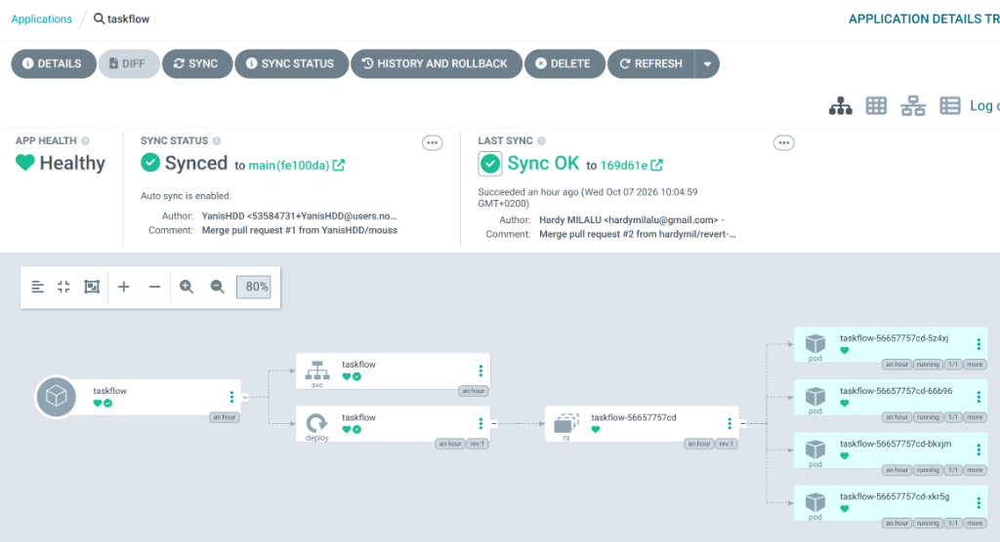
- **Détail du Pod en 1.0.0 :**  
  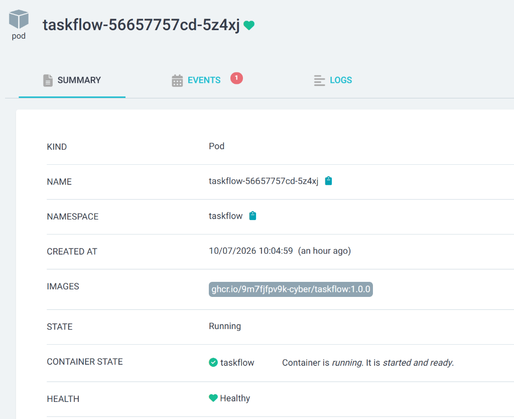
- **Test avec observe.sh (1.0.0) :**  
  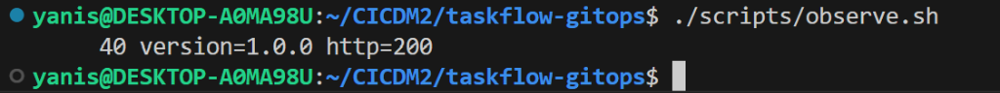

### 2. Montée de version en 2.0.0 par PR
- **PR #2 validée et mergée :**  
  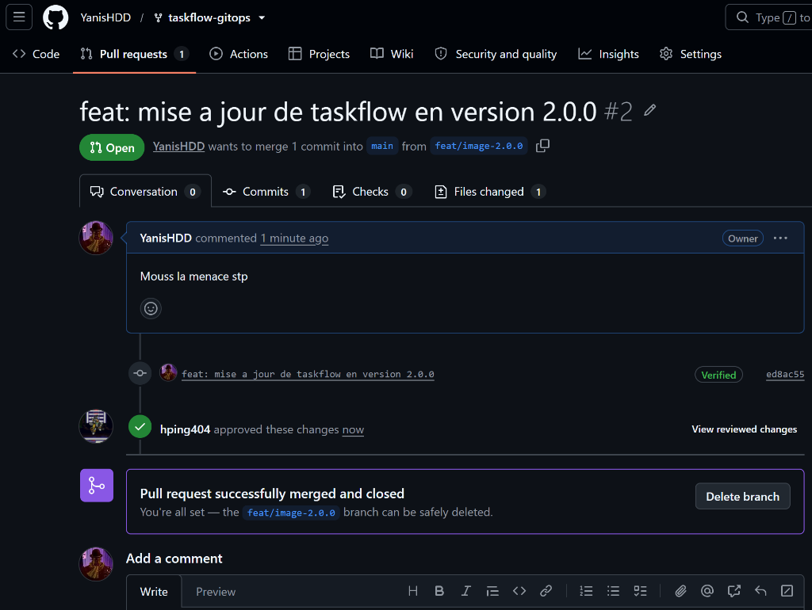
- **Argo CD avec les 4 pods en 2.0.0 (rev:2) :**  
  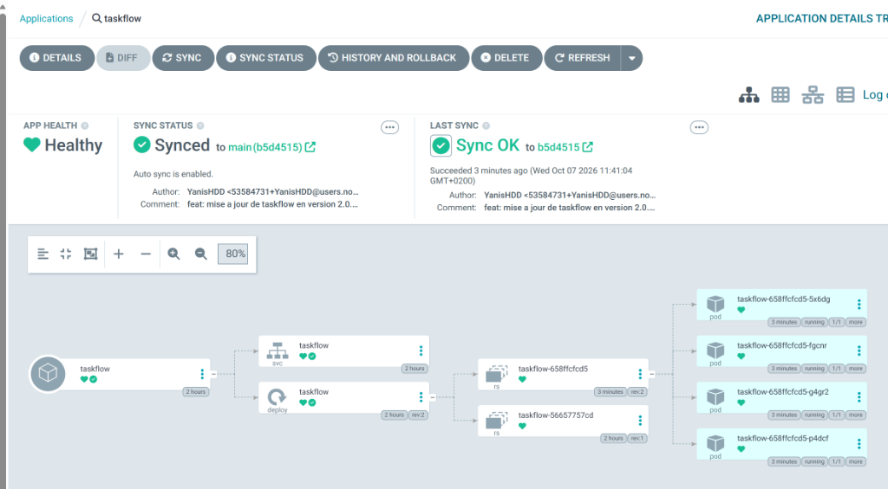
- **Détail du Pod en 2.0.0 :**  
  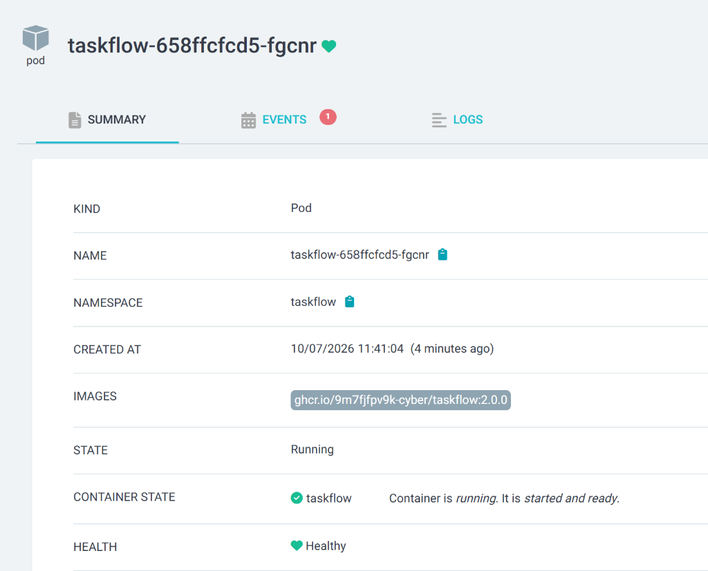
- **Test avec observe.sh basculé en 2.0.0 :**  
  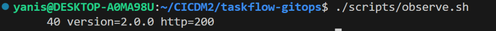

### 3. Test de dérive et Self-Heal
- **Commande kubectl scale à 1 replica :**  
  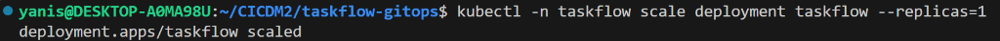
- **Preuve du Self-Heal (1 pod à 7 min, 3 pods recréés à 1 min) :**  
  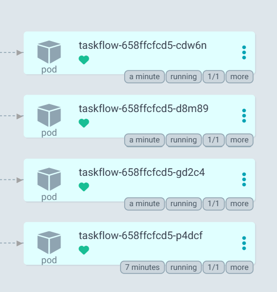

### 4. Rollback par git revert
- **Création du Revert sur GitHub :**  
  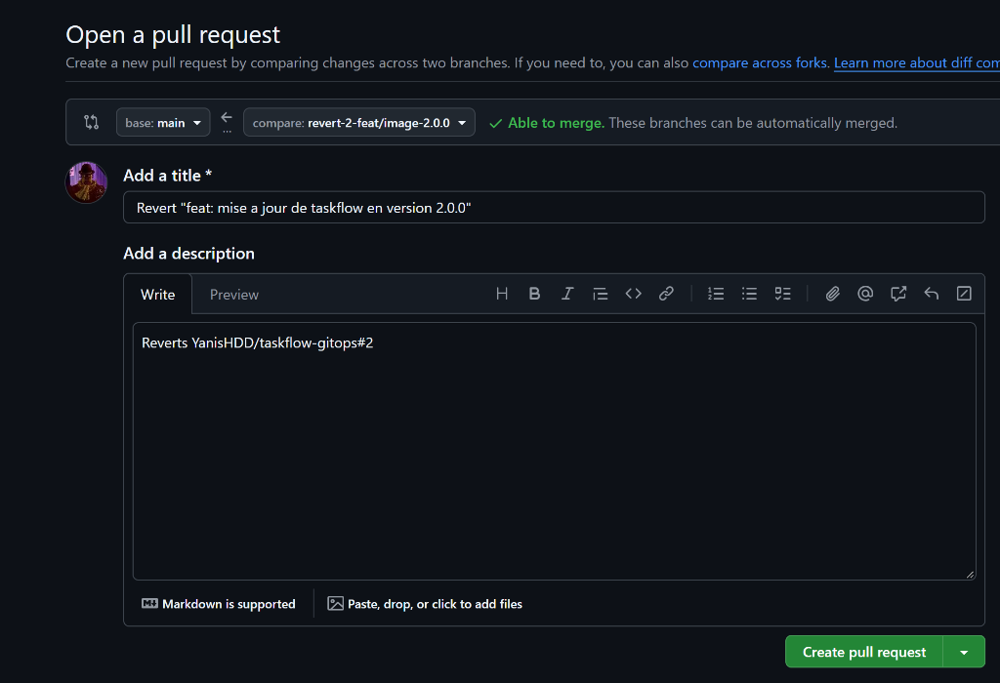
- **PR #3 de Revert validée et mergée :**  
  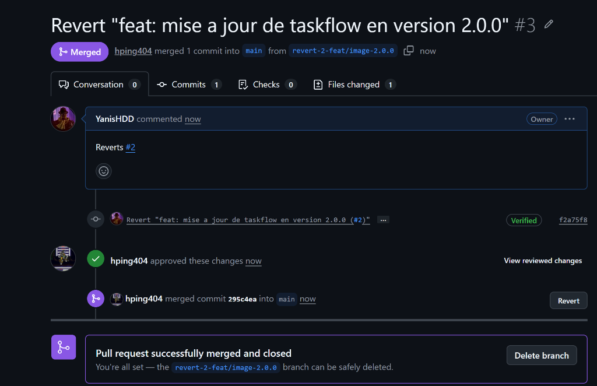
- **Argo CD de retour en 1.0.0 (rev:3) :**  
  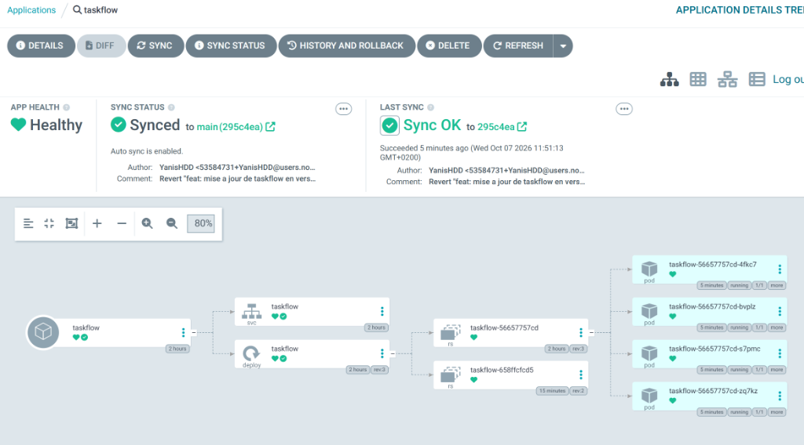
- **Détail du Pod réaligné en 1.0.0 :**  
  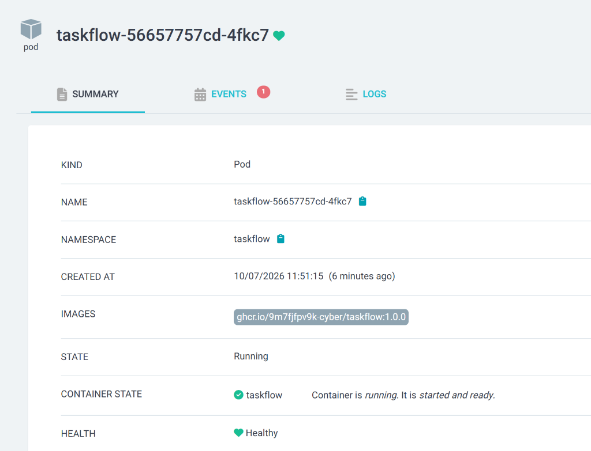

---

## Lab de l'Après-Midi — Stratégies Blue-Green et Canary

### 1. Stratégie Blue-Green (1.0.0 ➔ 1.1.0)

#### Journal des Déploiements Blue-Green

| ID | Date & Heure | Version | Action Git | Validateur | Statut Argo CD / Rollout | Résultat observe.sh |
|---|---|---|---|---|---|---|
| **#5** | 07/10/2026 14:25 | `1.0.0` (Blue-Green) | `6a24403` (PR #4) | Mouss / Yanis | **Synced** & **Healthy** (Rollout rev:1) | `40 version=1.0.0 http=200` |
| **#6** | 07/10/2026 14:35 | `1.1.0` (Preview) | `b3de244` (PR #5) | Mouss / Yanis | **Suspended** (Pause voulue, 8 pods au total) | Prod : `1.0.0` / Preview : `1.1.0` |
| **#7** | 07/10/2026 14:36 | `1.1.0` (Prod) | Commande `kubectl argo rollouts promote` | Manuel | **Healthy** (rev:2 actif, rev:1 coupé après 30s) | `40 version=1.1.0 http=200` |

#### Comment ça s'est passé :
On a remplacé notre `deployment.yaml` par le `rollout.yaml` de Blue-Green, avec deux services : `taskflow` pour la prod et `taskflow-preview` pour tester la nouvelle version. On a mis `autoPromotionEnabled: false` pour pas que ça bascule tout seul.

Quand on a mergé la PR pour passer en 1.1.0, Argo CD a déployé la nouvelle version mais s'est mis en pause (**Suspended**). C'est normal :
- On a eu **8 pods qui tournent en même temps** (4 anciens en 1.0.0 et 4 nouveaux en 1.1.0).
- Quand on a lancé `./scripts/observe.sh taskflow`, la prod répondait toujours à 100% en 1.0.0.
- Et avec `./scripts/observe.sh taskflow-preview`, on a pu tester la 1.1.0 tranquillement sans impacter les utilisateurs.

Une fois qu'on a vu que la preview marchait nickel, j'ai tapé :
```bash
kubectl argo rollouts promote taskflow -n taskflow
```
La prod a basculé d'un coup sur la 1.1.0 (`40 version=1.1.0 http=200`). Les anciens pods en 1.0.0 sont restés en vie pendant 30 secondes au cas où on voulait revenir en arrière, puis se sont coupés tout seuls.

#### Preuves Visuelles Blue-Green :
- **Mise en place du Rollout Blue-Green :**  
  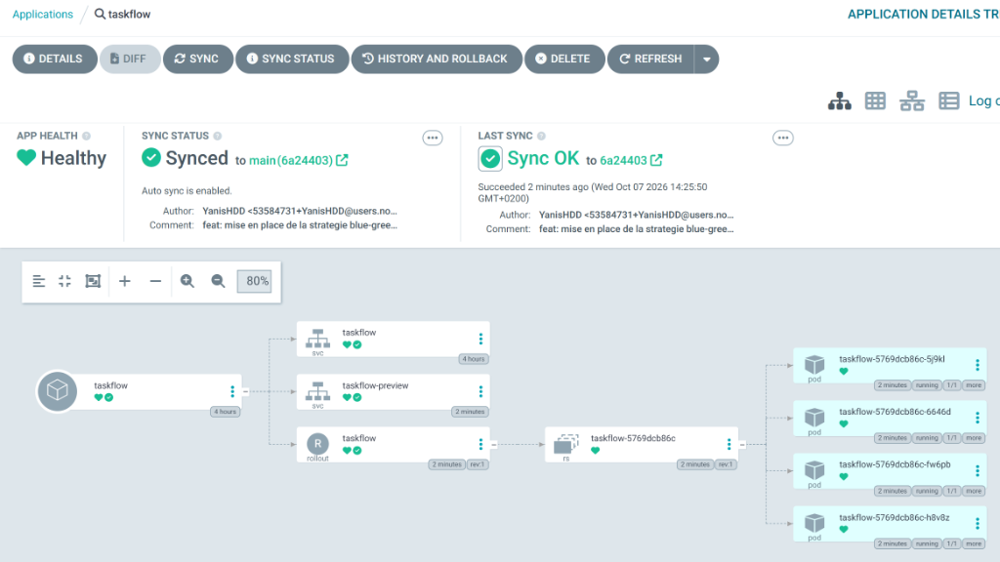
- **PR #4 validée et mergée :**  
  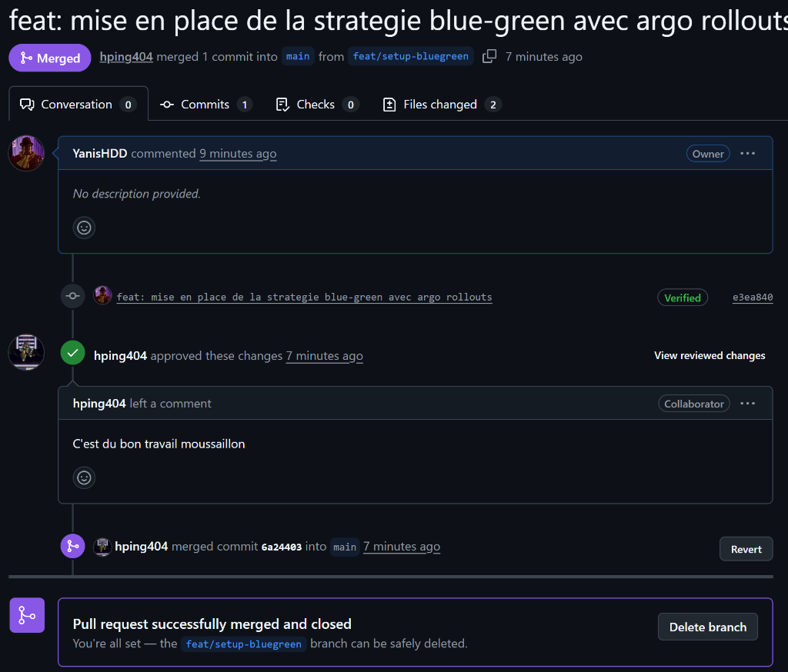
- **Preview active (8 pods et statut Suspended) :**  
  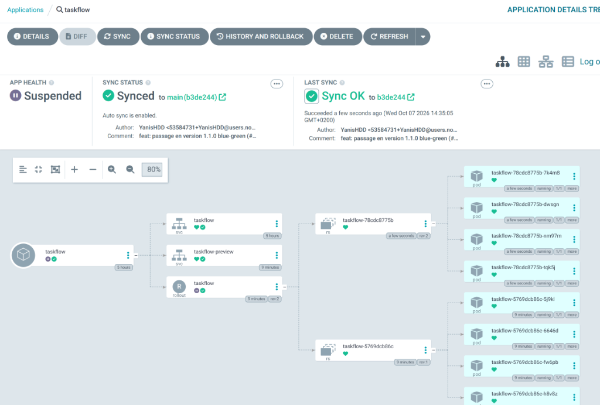
- **Test observe.sh (prod en 1.0.0 vs preview en 1.1.0) :**  
  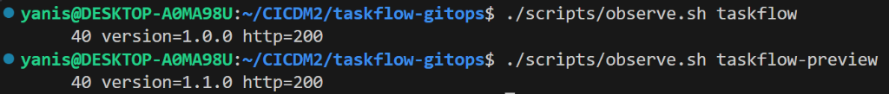
- **Promotion vers la prod :**  
  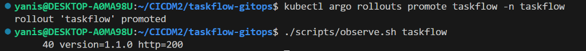
- **Cluster après les 30s (les anciens pods sont coupés) :**  
  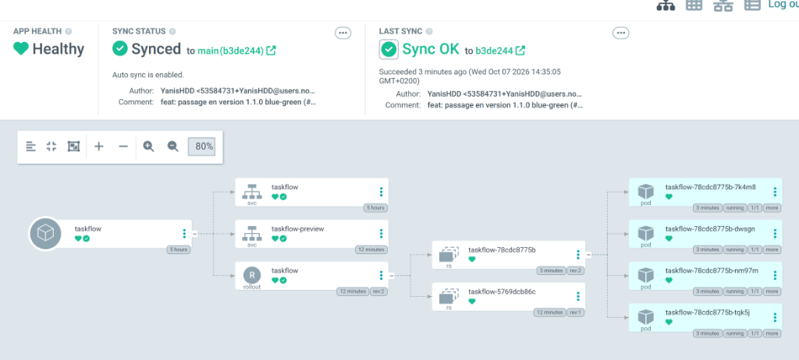

---

### 2. Stratégie Canary (1.1.0 ➔ 2.0.0 ➔ 2.1.0 buggée)

#### Journal des Déploiements Canary

| ID | Date & Heure | Version | Action Git | Validateur | Statut Argo CD / Rollout | Résultat observe.sh |
|---|---|---|---|---|---|---|
| **#8** | 07/10/2026 15:03 | `1.1.0` (Canary Setup) | `7e4983f` (PR #8) | Mouss / Yanis | **Synced** & **Healthy** (Rollout Canary rev:2) | `40 version=1.1.0 http=200` |
| **#9** | 07/10/2026 15:09 | `2.0.0` (Canary 25%) | `9d3312e` (PR #9) | Mouss / Yanis | **Suspended** / **Paused** (1 pod canary, 3 pods stables) | Split de trafic (ex: 31 en 1.1.0 / 9 en 2.0.0) |
| **#10** | 07/10/2026 15:15 | `2.0.0` (Promotion 100%) | Commande `kubectl argo rollouts promote` | Manuel | **Healthy** (4 pods passés en 2.0.0 rev:3) | `40 version=2.0.0 http=200` |
| **#11** | 07/10/2026 15:44 | `2.1.0` (Crash test) | `18c96db` (PR #10) | Mouss / Yanis | **Suspended** (Palier 25% actif) | `28 v2.0.0` / `8 v2.1.0` / `4 erreurs 500` ! |
| **#12** | 07/10/2026 15:52 | `2.0.0` (Abort d'urgence) | Commande `kubectl argo rollouts abort` | Manuel (coupure d'urgence) | **Degraded** (Canary coupé, retour 100% stable) | `40 version=2.0.0 http=200` (sauvetage réussi) |

#### Comment ça s'est passé :
On a remplacé notre stratégie par Canary dans `rollout.yaml` et supprimé le service preview qui ne sert plus ici.
1. **Le palier à 25% (version 2.0.0) :**
   Quand on a déployé la 2.0.0, le Rollout s'est mis en pause automatique à 25%. Avec le `--watch`, on voyait bien 1 pod en version Canary (2.0.0) et 3 pods en version Stable (1.1.0).
   En lançant `observe.sh`, on a eu plusieurs répartitions : d'abord 26 / 14, puis 31 / 9. Comme le disait le prof : *« Sans ingress ni service mesh, la part de trafic suit la proportion de pods : 4 réplicas → 25% = 1 pod sur 4. Un pourcentage précis demande un traffic router »*. C'est du round-robin K8s standard, et le 31 en 1.1.0 contre 9 en 2.0.0 colle quasiment pile aux 75% / 25% théoriques !
2. **La montée vers 100% :**
   J'ai lancé la promotion avec `kubectl argo rollouts promote taskflow -n taskflow`. La bascule vers 100% n'est pas instantanée : elle a pris environ 1 minute / 1 minute 30 parce que le manifest contient des pauses automatiques (pause de 60s au palier 50%, pause de 30s au palier 75%). La preuve se voit direct sur l'âge échelonné de nos 4 pods sur la capture : 6m21s, 114s, 53s et 22s !
3. **Le crash test (version 2.1.0) et l'abort d'urgence :**
   En déployant la version 2.1.0, le piège s'est déclenché au premier palier de 25% : alors que le pod était affiché tout vert (`Healthy`) par les probes Kubernetes, `observe.sh` a fait remonter direct des erreurs utilisateurs : **`4 version=aucune http=500`** !
   Pour éviter d'impacter plus de monde, j'ai tout de suite tapé :
   ```bash
   kubectl argo rollouts abort taskflow -n taskflow
   ```
   L'effet a été immédiat : le pod 2.1.0 a été coupé (`ScaledDown`), et 100% des requêtes sont revenues instantanément sur la version stable 2.0.0 (`40 version=2.0.0 http=200`).
   Dans Argo CD, le Rollout passe alors en statut **Degraded** (avec l'événement explicite : `RolloutAborted: Rollout aborted update to revision 4`).

---

### 3. Réponses aux Questions d'Analyse (Livrable Après-Midi)

#### A. « Blue-Green ou Canary pour TaskFlow ? » (Risque vs Coût)
- **Niveau coût / ressources :**  
  - Le **Blue-Green** est plus cher : il double temporairement les ressources (2× pods en simultané, soit 8 pods au lieu de 4). Sur un gros cluster avec beaucoup de CPU/RAM, ça coûte le double en infrastructure pendant les bascules.
  - Le **Canary** est beaucoup plus économe : il n'ajoute que les pods nécessaires par palier (1 pod en plus à 25%), donc il consomme à peine 1.25× les ressources.
- **Niveau risque :**  
  - Le **Blue-Green** protège 100% des utilisateurs avant la bascule grâce au service preview (`taskflow-preview`), mais la bascule est binaire (tout ou rien) : si un bug passe à travers les tests de preview, 100% des utilisateurs se le prennent d'un coup.
  - Le **Canary** expose une petite part d'utilisateurs réels au bug (ici 25% ont vu les erreurs 500 sur la 2.1.0), mais il permet de limiter la casse et de couper en urgence (`abort`) avant que 100% des clients ne soient touchés.
- **Verdict pour TaskFlow :**  
  Pour TaskFlow, **Canary** est le choix le plus pertinent car l'application est légère et le Canary permet de valider le comportement avec du vrai trafic par petits paliers sans doubler la facture d'hébergement. Si le métier refuse catégoriquement qu'un seul utilisateur voie une erreur, on privilégiera Blue-Green.

#### B. « Pendant un canary, vous faites un abort. Que montrent le Rollout, Argo CD et Git, et que faut-il faire ensuite ? »
- **Ce que montre le Rollout :** Il affiche le statut **`Degraded`**. Il a mis la révision Canary à l'écart (`ScaledDown`) et a réactivé 100% du trafic sur l'ancienne révision stable (4 pods en 2.0.0).
- **Ce que montre Argo CD :** L'application et le Rollout passent en statut **`Degraded`** (cœur brisé). Dans l'onglet Events du Rollout, on voit bien l'événement : `RolloutAborted: Rollout aborted update to revision 4`.
- **Ce que montre Git :** Sur Git, la branche `main` contient toujours le commit qui demande de déployer l'image buggée `2.1.0` ! Le cluster et Git sont donc désynchronisés.
- **Ce qu'il faut faire ensuite :** Il faut impérativement faire un **`git revert`** (ou une Pull Request de rollback) sur Git pour remettre l'image `2.0.0` sur `main`. Dès que Git aura à nouveau la version 2.0.0, Argo CD va se resynchroniser, le Rollout sortira de l'état avorté et redeviendra **100% `Healthy`** (cœur vert). C'est la règle d'or du GitOps : Git doit toujours être corrigé pour refléter l'état voulu.

---

### Preuves Visuelles Canary :
- **PR #8 de mise en place Canary :**  
  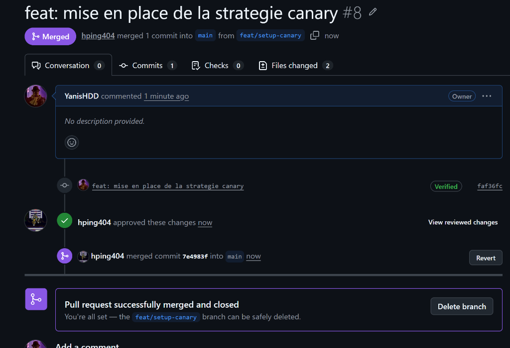
- **Rollout Canary initial (rev:2 actif) :**  
  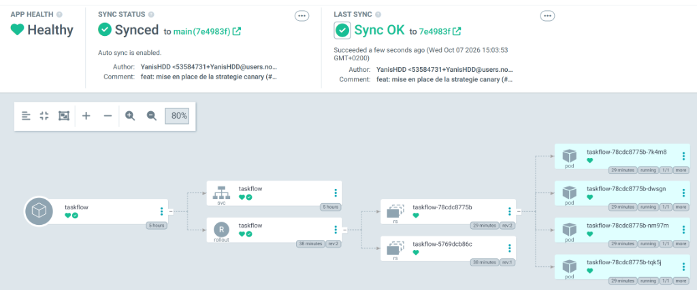
- **Tableau de bord --watch au palier 25% (1 pod canary, 3 stable) :**  
  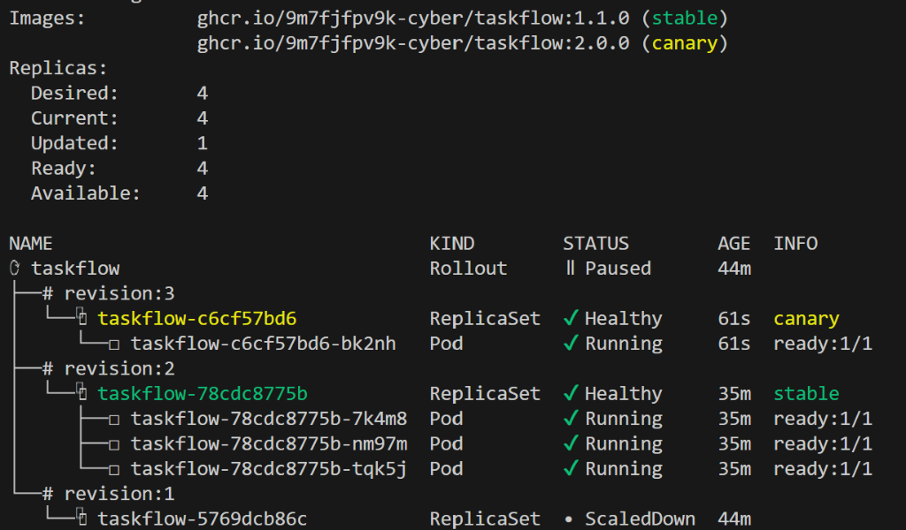
- **Trafic partagé à 25% (26 en v1.1.0 / 14 en v2.0.0) :**  
  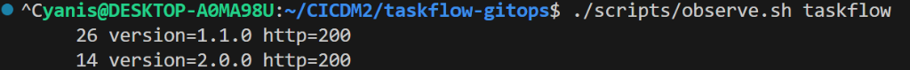
- **Argo CD suspended pendant le palier :**  
  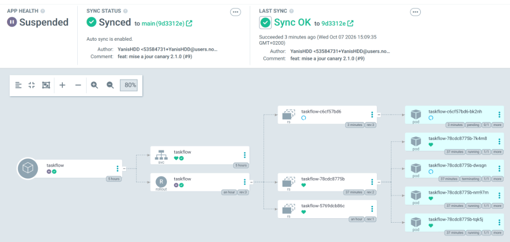
- **Tests répétés sur observe.sh (31 en v1.1.0 / 9 en v2.0.0) :**  
  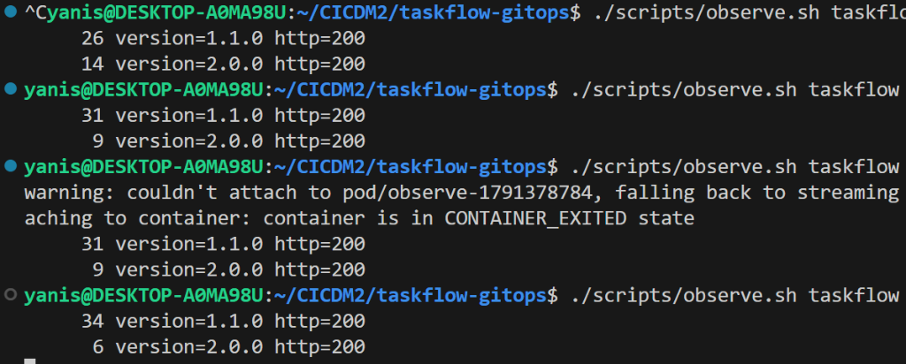
- **Déploiement 100% réussi avec pods échelonnés :**  
  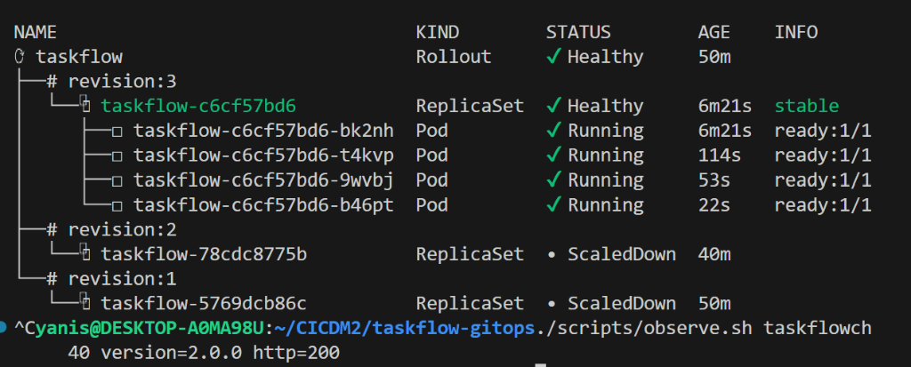
- **PR #10 de l'image 2.1.0 mergée :**  
  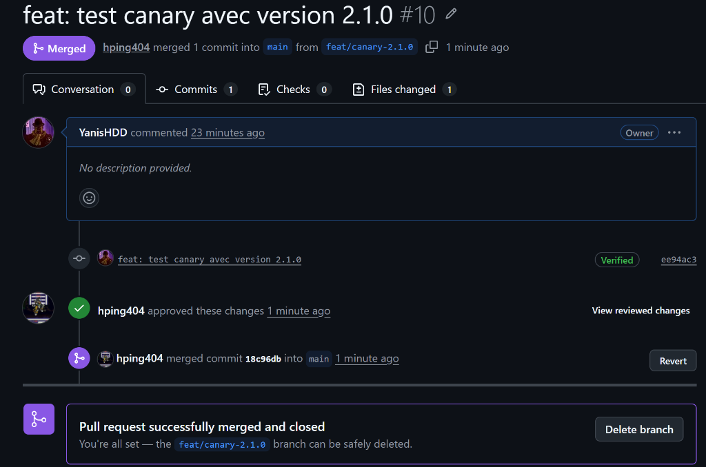
- **Argo CD suspended en 2.1.0 :**  
  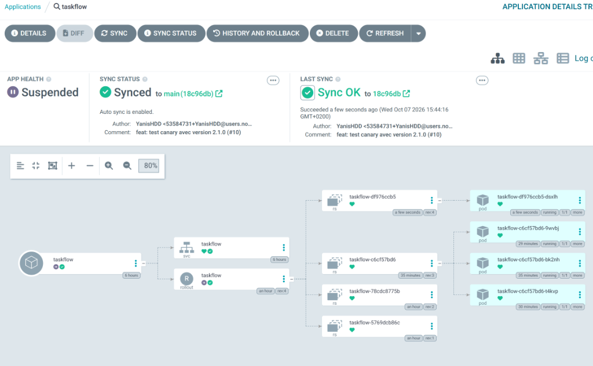
- **Pod 2.1.0 trompeur affiché Healthy par K8s :**  
  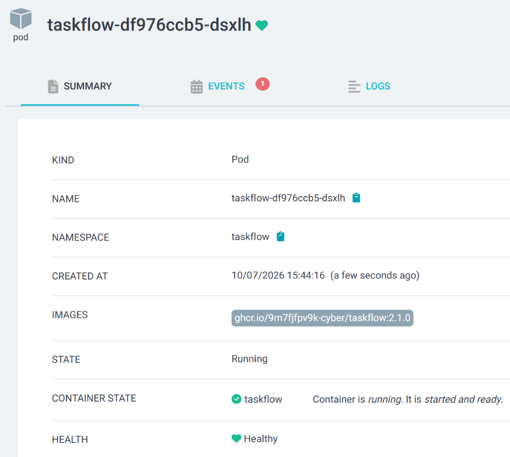
- **Détection des erreurs HTTP 500 sur observe.sh :**  
  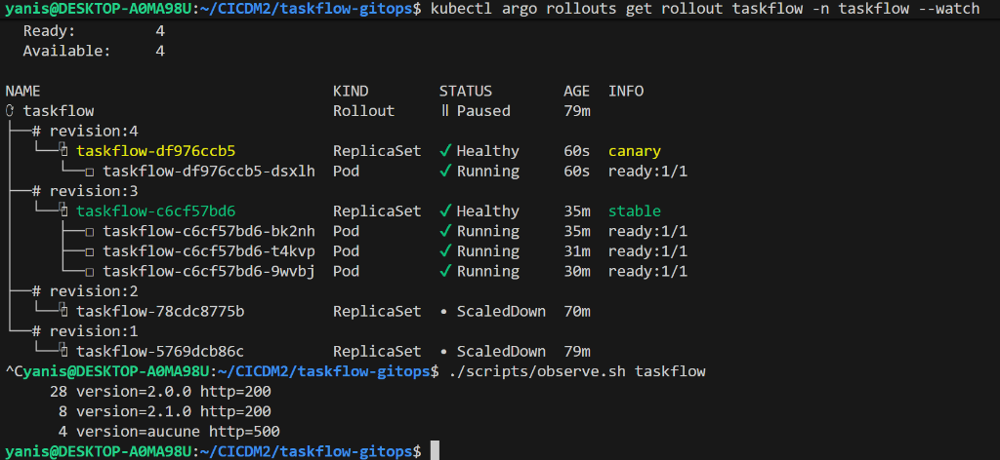
- **Abort d'urgence et retour instantané à 100% en 2.0.0 :**  
  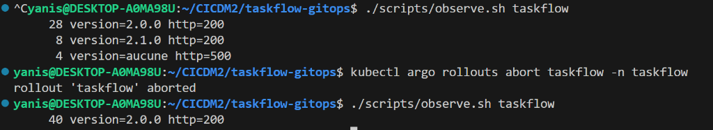
- **Rollout en statut Degraded après l'abort :**  
  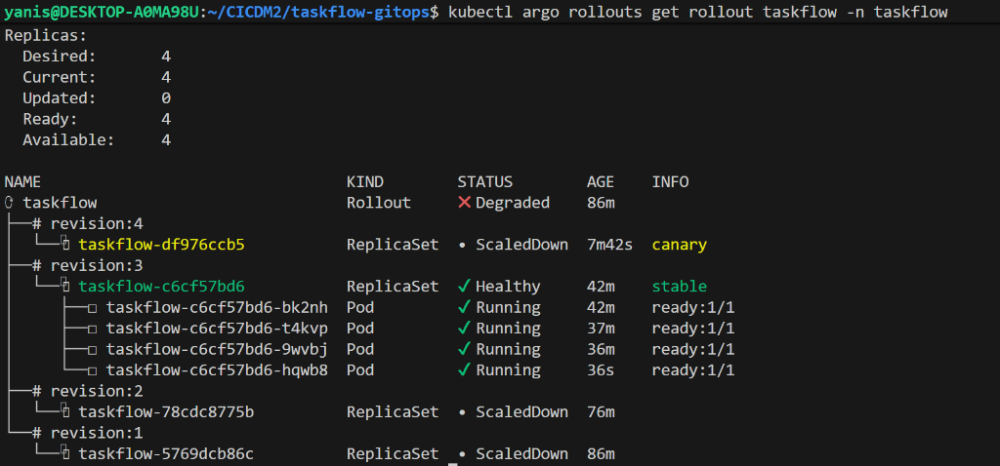
- **Événement RolloutAborted et statut Degraded dans Argo CD :**  
  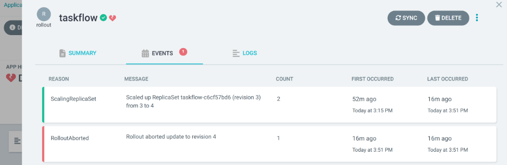


---

## Jour 3 — Robustesse, Rollback Automatique et Chaîne de Preuves (Lab du Matin)

Bienvenue sur le journal de bord du Jour 3 ! Aujourd'hui, l'objectif est d'amener notre chaîne GitOps à **décider seule et prouver ses choix**. Plus besoin d'un humain qui panique devant des dashboards : le pipeline teste la robustesse de chaque nouvelle version, détecte les anomalies sous charge, coupe immédiatement le trafic toxique et sauve la production en totale autonomie.

> 🧭 **Accès direct J3 :** [1. Synthèse Déploiements](#1-synthèse-du-journal-des-déploiements-jour-3) · [2. Déroulement Pas-à-Pas](#2-étape-par-étape--comment-on-a-construit-la-chaîne-autonome) · [Tableau des 4 Preuves](#tableau-récapitulatif-de-la-chaîne-de-preuves-slide-9) · [3. Postmortem v2.1.0](#3-postmortem-de-lincident-v210) · [4. Galerie Visuelle J3 Matin](#4-galerie-des-preuves-visuelles-jour-3) · [5. Lab C : Mini-PSSI & Quality Gates](#jour-3-après-midi--mini-pssi-policy-as-code--quality-gates-lab-c)

---

### 1. Synthèse du Journal des Déploiements (Jour 3)

| # | Heure | Version | Commit / PR | Auteurs / Réviseurs | Statut Argo CD / Rollout | Résultat & Analyse du trafic |
|---|---|---|---|---|---|---|
| **#13** | 08/10 11:19 | `2.0.0` (Setup Robustesse) | PR #13 (`7434866`) | Yanis / Moustapha | **Synced** & **Healthy** | Mise en place de l'AnalysisTemplate, ConfigMap k6 (60s) et suppression de Deployment. |
| **#14** | 08/10 11:30 | `2.1.0` (Incident Canary) | PR #14 (`8a1a691`) | Yanis / Moustapha | **Degraded** & **RolloutAborted** | k6 détecte 29.44% d'erreurs 500 sur le canary. **Abort automatique immédiat** par Argo Rollouts ! |
| **#15** | 08/10 12:07 | `2.0.0` (Rollback GitOps) | PR #15 (`bf31b6c`) | Yanis / Moustapha | **Synced** & **Healthy** | `git revert` de la PR #14. Retour officiel de Git sur la version 2.0.0 stable. |
| **#16** | 08/10 12:26 | `2.2.0` (Correctif Propre) | PR #16 (`923d2c9`) | Yanis / Moustapha | **Synced** & **Healthy** | AnalysisRun **100% réussi** sur le canary. Montée progressive (50%, 75%) à 100% sans accroc. |

---

### 2. Étape par Étape : Comment on a construit la chaîne autonome

#### Étape A · Le Test Étalon et l'Analyse Automatique
1. **Le test étalon sur la version saine (v2.0.0) :**
   Avant de modifier quoi que ce soit, on a lancé un test de charge de référence avec le script ./scripts/charge.sh http://taskflow.
   - **Résultat étalon :** 1458 requêtes traitées, **0.00% d'échec** (100% de code 200), et un temps de réponse p95 excellent à **8.11 ms** (bien en dessous de la limite autorisée de 250 ms). Les seuils sont validés.
2. **L'ajustement clé du ConfigMap (Consigne prof) :**
   Dans le ConfigMap k6-robustesse, la durée de test était initialement fixée à 30s. Suite à la consigne du professeur pour éviter les faux positifs (notamment pour laisser le temps au trafic de se stabiliser et ne pas avorter prématurément sur un pic de démarrage), nous avons passé le test à **duration: '60s'**.
3. **Le rôle de l'AnalysisTemplate :**
   L'objet AnalysisTemplate (`robustesse-k6`) définit le contrat de test : il lance un Job Kubernetes basé sur l'image grafana/k6:latest, qui monte notre script k6 et attaque spécifiquement l'URL fournie en argument (http://taskflow-canary).
4. **Validation de l'étape A.4 :**
   Sur notre PR #13, nous avons supprimé tout manifest de Deployment pour ne conserver que notre Rollout. La commande demandée kubectl -n taskflow get analysistemplate,configmap,svc,rollout confirme que toutes les briques sont prêtes et que le service taskflow-canary est disponible.

---

#### Étape B · L'Incident v2.1.0 et l'Abort Automatique
On a ensuite mergé la PR #14 pour livrer la version 2.1.0. En observant avec kubectl argo rollouts get rollout taskflow -n taskflow --watch, voici le film de l'incident :

1. **Le palier 25% démarre :** Argo Rollouts crée 1 pod en version 2.1.0 (taskflow-df976ccb5-x6qnt) et bascule le sélecteur du service taskflow-canary dessus.
2. **L'AnalysisRun entre en action :** Un Job Kubernetes éphémère démarre et lance k6 contre http://taskflow-canary/tasks.
3. **La détection du piège :** La version 2.1.0 renvoie des erreurs HTTP 500 intermittentes sur sa logique métier (/tasks), alors que sa probe /health répondait 200 OK ! En 60 secondes, k6 enregistre :
   - **29.44 % de requêtes en erreur** (174 échecs sur 591).
   - Une latence p95 de **315.74 ms** (seuil max : 250 ms).
4. **L'échec de k6 et l'état Failed :** k6 s'arrête avec un code d'erreur car les deux seuils sont franchis. Dans Kubernetes, le Job passe en statut **Failed**.
   > **Pourquoi ce Failed dans Argo CD est normal et salvateur ?**  
   > Ce Job n'est pas l'application elle-même, c'est l'outil de contrôle qualité. C'est **précisément parce que le Job a échoué** qu'Argo Rollouts a su que la version était défectueuse. Il reste affiché en rouge dans Argo CD pour servir de preuve médico-légale de l'incident !
5. **L'Abort automatique instantané :**
   Dès que l'AnalysisRun passe en échec, le **contrôleur Argo Rollouts** prend la main sans aucune action humaine :
   - Il émet l'événement Kubernetes **RolloutAborted**.
   - Il coupe le pod canary 2.1.0 (• ScaledDown).
   - Il rebascule immédiatement 100% du trafic sur la version stable 2.0.0 en créant un 4e pod de secours (taskflow-c6cf57bd6-zbbsg horodaté à **11:31:28**).
   - **Bilan client : 0 utilisateur réel de production n'a été touché par les erreurs 500 !**

---

#### Étape C · La Chaîne de 4 Preuves (Slide 9 du cours)
Pour établir notre postmortem sans reproche, nous avons réuni les 4 preuves officielles :
1. **Preuve 1 (Rollout & Version) :** Le Rollout affiche le statut ✖ Degraded avec le message RolloutAborted: Metric 'test-de-charge-k6' assessed Failed. La révision 6 (2.1.0) est coupée et la révision 5 (2.0.0) reste active à 100%.
2. **Preuve 2 (AnalysisRun en échec) :** La ressource taskflow-df976ccb5-6-1 est marquée Failed suite au Job k6.
3. **Preuve 3 (Logs k6 - La cause racine) :** Le rapport final de k6 prouve les 29.44% d'échecs sur GET /tasks et le temps p95 de 315.74 ms.
4. **Preuve 4 (Chronologie des événements Kubernetes) :** Les événements enregistrent la séquence exacte : MetricFailed ➔ AnalysisRunFailed ➔ RolloutAborted ➔ SwitchService ➔ ScalingReplicaSet.
   *(Note de l'équipe : désolé si le terminal de la capture n'est pas assez large pour afficher la ligne complète à droite, mais les colonnes TYPE, REASON et le message RolloutAborted sont parfaitement visibles !)*
5. **Preuve supplémentaire (Horodatage de récupération) :** Sur l'interface Argo CD, le pod de secours taskflow-c6cf57bd6-zbbsg affiche l'heure de création exacte 11:31:28, attestant de la résilience à la seconde près.

##### Tableau Récapitulatif de la Chaîne de Preuves (Slide 9 du cours)

| # | Question du cours | Commande exacte | Fait mesuré & Constat technique | Preuve visuelle |
|---|---|---|---|---|
| **#1** | *Quelle révision, quelle image ?* | `kubectl argo rollouts get rollout taskflow -n taskflow` | Révision 6 (`taskflow:2.1.0`) en échec `✖ Degraded`. Repli 100% sur révision 5 (`2.0.0`) saine. | [Capture #36](docs/screenshots/36-canary-2.1.0-rollout-aborted-failed.png) |
| **#2** | *Quelle métrique a échoué ?* | `kubectl -n taskflow describe analysisrun <nom>` | Métrique `test-de-charge-k6` passée en statut `Failed` (1 échec > 0 toléré). | [Capture #39](docs/screenshots/39-argocd-ui-degraded-analysisrun-failed.png) |
| **#3** | *Ce que k6 a mesuré ?* | `kubectl -n taskflow logs job/<nom-job>` | **29.44 % d'erreurs 500** (174/591) sur `GET /tasks`, latence $p(95) = 315.74\text{ ms}$ (seuil 250 ms dépassé). | [Capture #37](docs/screenshots/37-canary-2.1.0-k6-logs-failed.png) |
| **#4** | *La chronologie exacte ?* | `kubectl -n taskflow get events --sort-by=.lastTimestamp` | Événements : `MetricFailed` ➔ `AnalysisRunFailed` ➔ `RolloutAborted` ➔ `SwitchService` ➔ `ScalingReplicaSet`. *(Terminal tronqué à droite)* | [Capture #38](docs/screenshots/38-canary-2.1.0-events-rollout-aborted.png) |
| **Bonus** | *Preuve de reprise immédiate ?* | Interface Argo CD (Détail pod) | Pod `taskflow-c6cf57bd6-zbbsg` (2.0.0) recréé à **11:31:28**, à la seconde exacte de l'abort. | [Capture #40](docs/screenshots/40-argocd-pod-2.0.0-recovery-timestamp.png) |

---

#### Étape D · Rollback GitOps et Déploiement Réussi de la v2.2.0
1. **Pourquoi faire un git revert ?**  
   Même si le cluster est sauvé en 2.0.0, Git contenait encore le commit demandant la 2.1.0. Pour respecter la règle d'or du GitOps, nous avons cliqué sur **Revert** sur la PR #14 pour créer et merger la **PR #15**. Dès le merge, Argo CD resynchronise et le Rollout redevient **100% Healthy** (cœur vert).
2. **Le déploiement de la version 2.2.0 (PR #16) :**  
   Nous avons ensuite ouvert la PR #16 avec l'image ghcr.io/9m7fjfpv9k-cyber/taskflow:2.2.0.
   - Au palier 25%, l'AnalysisRun k6 se lance.
   - En 60 secondes, k6 valide **100% de code HTTP 200** et une latence inférieure à 10 ms.
   - L'AnalysisRun passe en **✔ Successful** !
   - Le Rollout enchaîne automatiquement les paliers 50% et 75% (avec leurs pauses de 30s) sans aucune action manuelle.
   - L'application termine à 100% en version 2.2.0 avec le statut **✔ Healthy** !

---

### 3. Postmortem de l'Incident v2.1.0

> **Sans reproche :** on cherche ce qui a permis l'erreur, pas qui l'a faite. Ce document est également archivé en version autonome dans [`docs/postmortem-2.1.0.md`](docs/postmortem-2.1.0.md) pour le dossier MSPR.

| Champ | Valeur |
| --- | --- |
| Date et heure | 08/10/2026 à 11:30 (11:30:24 – 11:31:28 heure locale) |
| Version en cause | `ghcr.io/9m7fjfpv9k-cyber/taskflow:2.1.0` |
| PR à l'origine | PR #14 (`feat: passage a l image 2.1.0 et ajout preuve A.4`) |
| Durée d'exposition | **0 seconde pour les utilisateurs finaux** (seul le trafic de test k6 a touché le pod canary) |
| Part du trafic touché | **0 % du trafic utilisateur réel** (100 % des requêtes de prod protégées sur la v2.0.0) |
| Détecté par | **Test de charge automatique k6** (`AnalysisRun` / métrique `test-de-charge-k6`) |
| Résolu par | **Abort automatique immédiat par le contrôleur Argo Rollouts**, puis `git revert` (PR #15) |

#### Chronologie des Événements

| Heure locale | Événement | Détail technique |
| --- | --- | --- |
| **11:30:09** | Merge de la PR #14 | La branche `main` passe sur l'image `taskflow:2.1.0`. |
| **11:30:22** | Détection Argo CD | Synchronisation automatique vers la révision 6 du Rollout. |
| **11:30:24** | Démarrage du Canary (25 %) | Création du pod `taskflow-df976ccb5-x6qnt`. Argo Rollouts bascule le sélecteur du service `taskflow-canary` vers ce pod. |
| **11:30:24** | Déclenchement de l'`AnalysisRun` | Lancement du Job K8s `02d0294e-...test-de-charge-k6.1` basé sur le template `robustesse-k6`. |
| **11:30:25** | Exécution du test de charge k6 | 5 utilisateurs virtuels bombardent `http://taskflow-canary/tasks` pendant 60 secondes. |
| **11:31:22** | Franchissement des seuils k6 | k6 détecte **29.44 % d'erreurs HTTP 500** et une latence $p(95) = 315.74\text{ ms}$. k6 quitte avec une erreur de seuil (`thresholds crossed`). |
| **11:31:28** | Échec de l'AnalysisRun | Le Job Kubernetes passe en statut `Failed`. L'AnalysisRun est marqué `Failed`. |
| **11:31:28** | **Abort automatique (`RolloutAborted`)** | Le contrôleur Argo Rollouts avorte le déploiement : <br>1. Événement `RolloutAborted` émis.<br>2. Bascule immédiate du service canary (`SwitchService`) vers la révision 5 stable.<br>3. Destruction du pod 2.1.0 défaillant (`ScaledDown`).<br>4. Remise à l'échelle de la révision 5 (2.0.0) à 4 pods complets avec création du pod de secours `taskflow-c6cf57bd6-zbbsg` horodaté à 11:31:28. |
| **12:07:53** | Rollback GitOps (`git revert`) | Approbation et merge de la PR #15 (`Revert PR #14`). Git repasse en 2.0.0, Argo CD resynchronise et le Rollout redevient **`Healthy`**. |
| **12:26:04** | Livraison du correctif v2.2.0 | Merge de la PR #16 : l'AnalysisRun k6 valide 100 % de succès (code 200), promotion automatique progressive (50 %, 75 %) jusqu'à 100 % `Healthy`. |

#### Composant défaillant et cause racine
- **Quel composant a échoué ?** L'application TaskFlow v2.1.0 sur la route métier `GET /tasks` (174 erreurs sur 591 requêtes, $p(95) = 315.74\text{ ms}$).
- **Pourquoi les probes Kubernetes ne l'ont-elles pas vu ?** Les sondes `readinessProbe` et `livenessProbe` interrogeaient uniquement le endpoint technique `/health`. Comme `/health` répondait `200 OK`, Kubernetes voyait le pod vert, alors que le code métier plantait en 500.
- **Cause racine :** Régression logicielle introduite dans la 2.1.0 sur `/tasks`, invisible pour les probes basiques `/health`, mais immédiatement stoppée par le test de robustesse k6.

#### Ce qui a bien fonctionné
1. **La porte de qualité automatique :** La chaîne a tranché seule en moins de 60 secondes sans intervention humaine.
2. **L'isolation totale du canary :** Grâce au service dédié `taskflow-canary`, aucun utilisateur réel n'a reçu d'erreur.
3. **Le repli instantané :** En moins d'une seconde, Argo Rollouts a rétabli 100% du trafic sur la version saine 2.0.0.

#### Actions correctives

| Action | Responsable | Échéance | Statut |
| --- | --- | --- | --- |
| Déploiement du correctif `2.2.0` | Yanis / Moustapha | Immédiat | **Fait (v2.2.0 à 100% Healthy)** |
| Alignement GitOps officiel par `git revert` (PR #15) | Yanis | Immédiat | **Fait (PR #15 mergée)** |
| Tests d'intégration automatisés en amont dans la CI (J1) | Équipe DevOps | Fin de sprint | Planifié |
| Documentation complète et archivage des preuves pour la MSPR | Yanis / Moustapha | J3 Matin | **Fait (`postmortem-2.1.0.md` & `README.md`)** |

---

### 4. Galerie des Preuves Visuelles (Jour 3)

#### Partie A : Test Étalon et Ressources Initiales
- **Seuils respectés sur le test étalon k6 (v2.0.0) :**  
  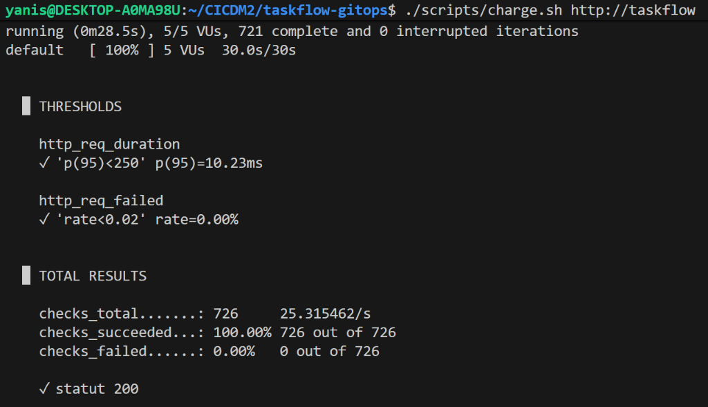
- **Résultat k6 étalon (1458 req, 0% erreur) :**  
  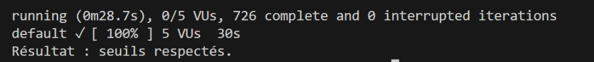
- **Vérification A.4 : Présence des CRDs, Template d'analyse, ConfigMap et Services :**  
  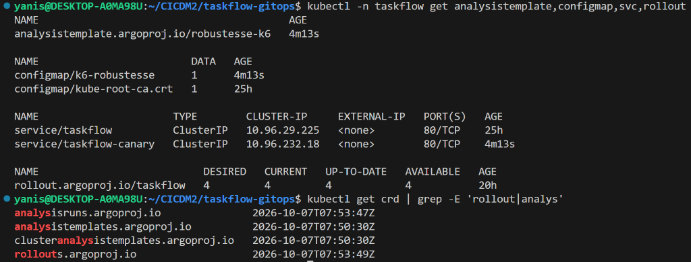

#### Partie B : L'Incident 2.1.0 et l'Abort Automatique
- **Arbre du Rollout en statut Degraded après l'abort automatique :**  
  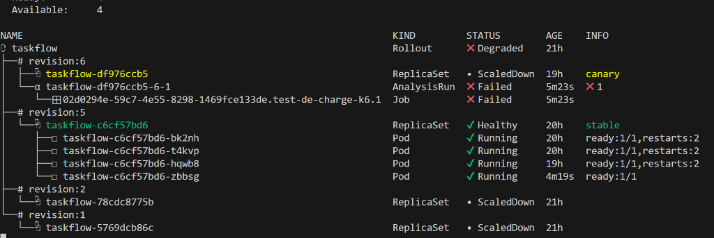
- **Preuve 3 : Logs du Job k6 montrant les 29.44% d'erreurs 500 :**  
  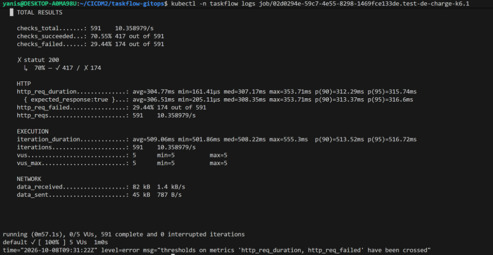
- **Preuve 4 : Événements Kubernetes avec l'événement RolloutAborted :**  
  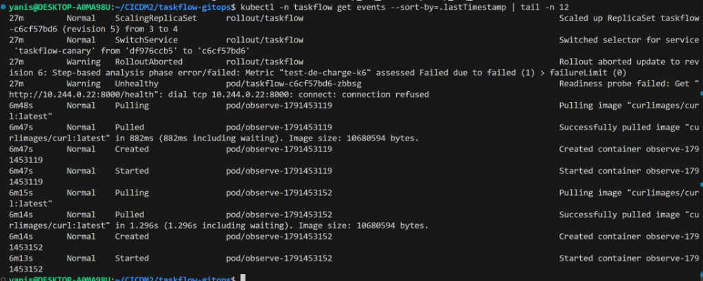  
  *(Désolé pour le terminal légèrement tronqué à droite sur la capture, écran d'ordinateur portable oblige !)*
- **Vue globale Argo CD : statut Degraded et Job rouge conservé pour enquête :**  
  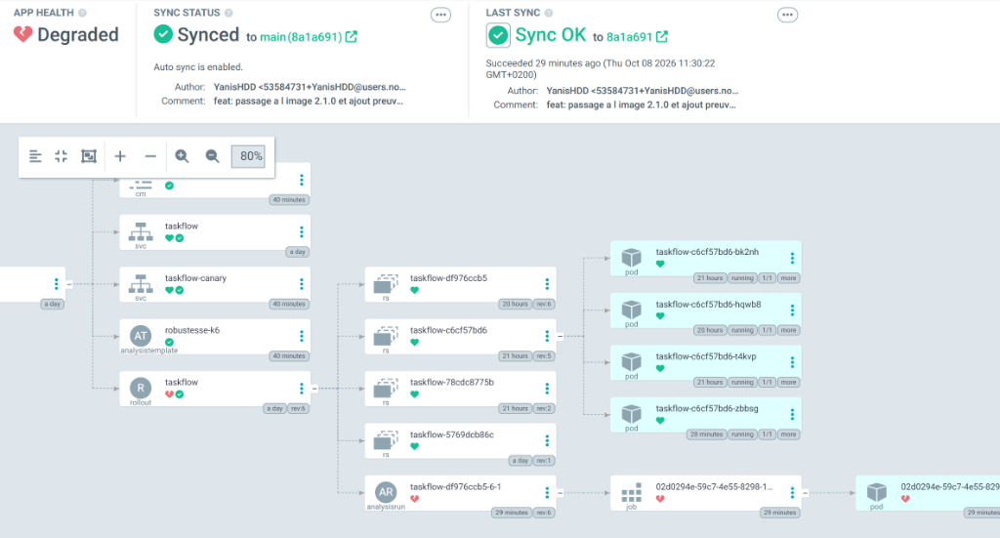
- **Preuve d'horodatage : Le 4e pod 2.0.0 régénéré immédiatement à 11:31:28 :**  
  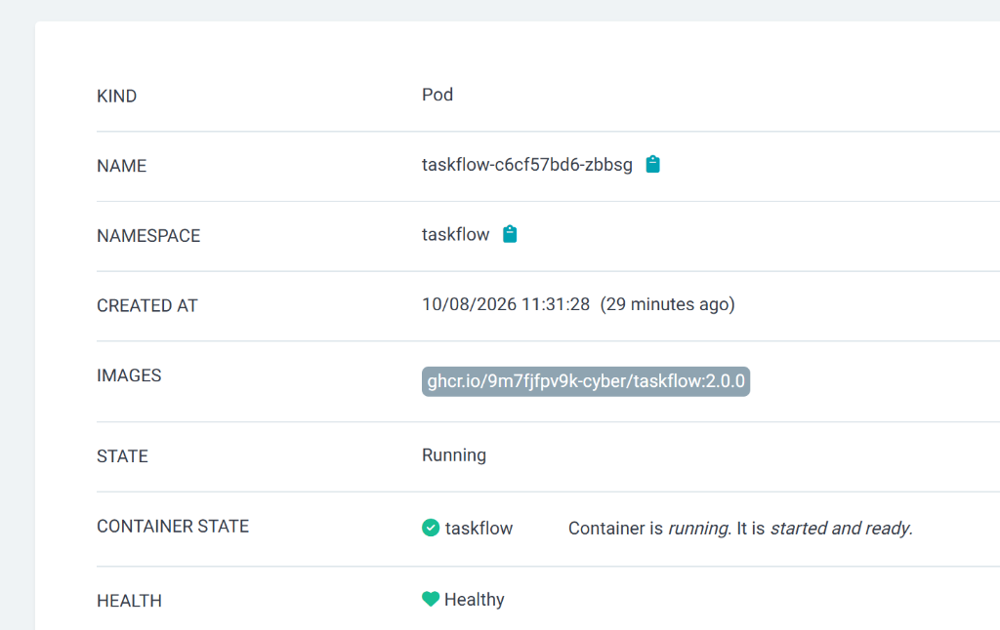

#### Partie C : Résolution GitOps et Succès de la 2.2.0
- **PR #15 de Revert GitOps approuvée et mergée :**  
  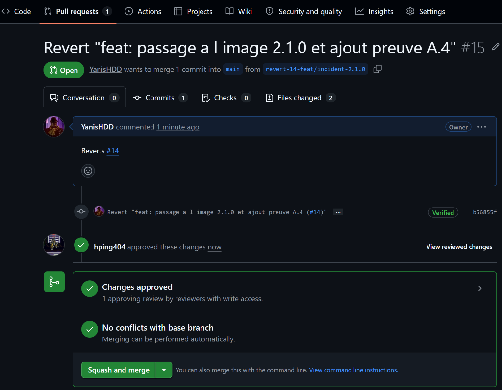
- **Retour à l'état Healthy sur la 2.0.0 après le revert GitOps :**  
  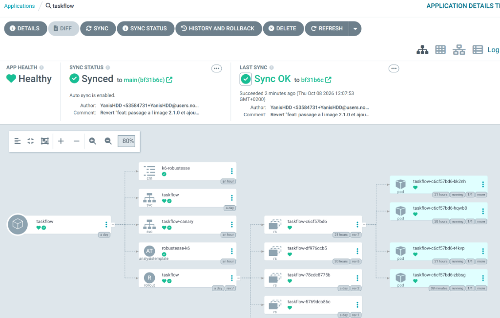
- **Déploiement 2.2.0 : AnalysisRun et Job en cours d'exécution au palier 25% :**  
  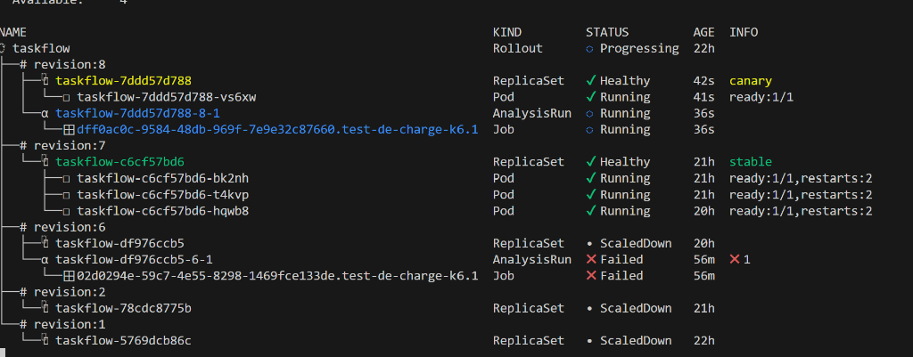
- **Succès de l'AnalysisRun (✔ Successful) sur la version 2.2.0 :**  
  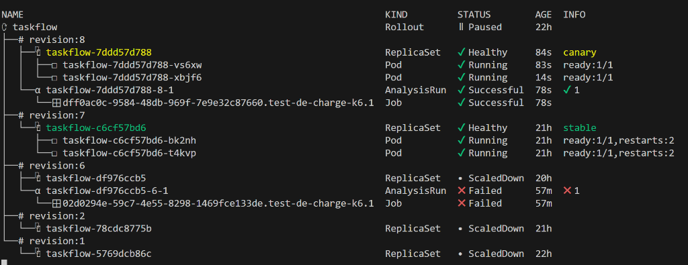
- **Argo CD franchissant automatiquement les pauses de 30s vers 50% et 75% :**  
  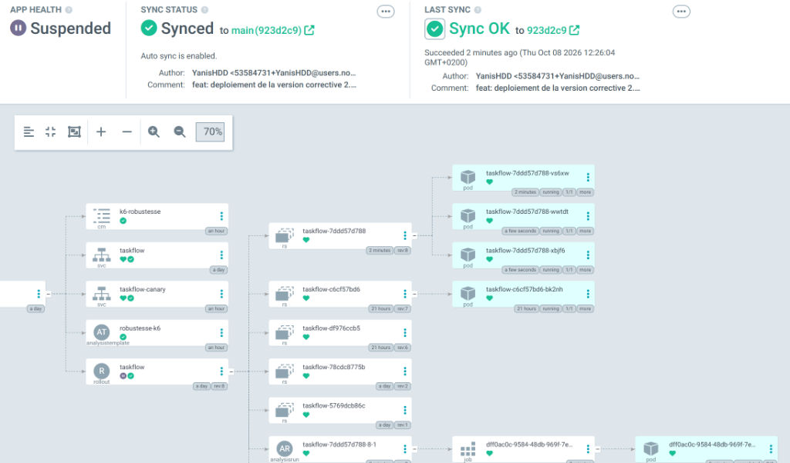
- **Déploiement 100% Healthy et Synced en version 2.2.0 sur Argo CD :**  
  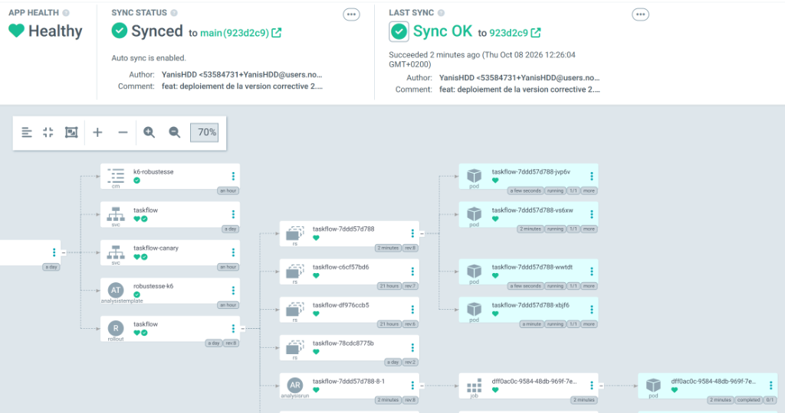
- **Preuve d'image v2.2.0 : Détail du pod `taskflow-7ddd57d788-vs6xw` actif et Healthy en version 2.2.0 :**  
  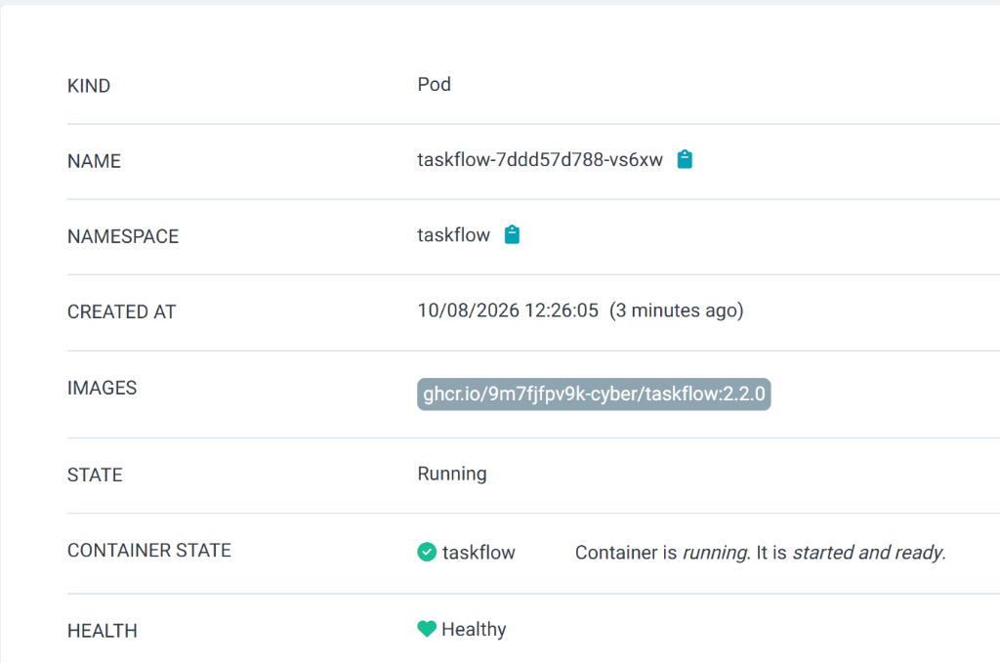

---

## Jour 3 Après-Midi — Mini-PSSI, Policy-as-Code & Quality Gates (Lab C)

Cet après-midi, nous avons transformé la sécurité d'un simple document texte en **garde-fous automatiques et bloquants** dans notre chaîne d'intégration continue (*Policy-as-Code*).  
Aucune image non tracée, aucun conteneur sans limite de ressources et aucun pod s'exécutant avec les privilèges `root` ne peut désormais être introduit en production : le pipeline CI (GitHub Actions) combiné au ruleset de protection de branche bloque systématiquement le merge.

---

### 1. Tableau Récapitulatif de la Mini-PSSI TaskFlow (Livrable Officiel)

Conformément aux exigences de la Mini-PSSI TaskFlow (Slide 14 & 17), voici la matrice complète de nos contrôles de sécurité :

| Règle | Exigence | Justification Sécurité | Outil de contrôle | Implémentation / Fichier | Statut & Preuve |
|---|---|---|---|---|---|
| **PSSI-R1** | Toute image a un tag explicite, **jamais `latest`** ni sans tag | Traçabilité absolue : savoir exactement quelle version tourne et garantir des rollbacks reproductibles | `conftest` (Rego / OPA) | `policies/kubernetes.rego` (`image_a_tag`) | **Actif & Bloquant** (PR #19 bloquée en rouge, Preuve 50) |
| **PSSI-R2** | Les images proviennent uniquement du registre homologué (`ghcr.io/9m7fjfpv9k-cyber/`) | Maîtrise de la chaîne d'approvisionnement logicielle : interdire les images externes non auditées | `conftest` (Rego / OPA) | `policies/kubernetes.rego` (`registre_autorise`) | **Actif & Bloquant** |
| **PSSI-R3** | Chaque conteneur déclare une limite de mémoire (`resources.limits.memory`) | Éviter le déni de service de l'hôte (OOMKill généralisé) : aucun pod ne doit épuiser le nœud hôte | `conftest` (Rego / OPA) | `policies/kubernetes.rego` (Règle rédigée par le binôme) | **Validé** (`memory: 256Mi` dans `rollout.yaml`) |
| **PSSI-R4** | Les pods ne tournent jamais en root (`securityContext.runAsNonRoot: true`) | Principe du moindre privilège : limiter le rayon d'impact (*blast radius*) en cas d'évasion de conteneur | `conftest` (Rego / OPA) | `policies/kubernetes.rego` (Règle rédigée par le binôme) + `rollout.yaml` | **Validé** (Échec initial Preuve 48, puis corrigé et validé Preuve 49) |
| **PSSI-R5** | Aucune vulnérabilité `HIGH` ou `CRITICAL` corrigeable dans les images déployées | Hygiène logicielle stricte : interdire la mise en production de CVEs connues et réparables | `Trivy` (Aqua Security) | `.github/workflows/pssi.yml` (Scan automatique des manifests) | **Validé** (Scan réussi, exceptions documentées dans `.trivyignore`) |

---

### 2. Gestion des Exceptions et Dérogations (`.trivyignore`)

La politique PSSI stipule qu'aucune exception n'est tolérée de manière informelle :  
> *« Toute exception doit être écrite, justifiée, datée et limitée dans le temps (fichier `.trivyignore` commenté pour PSSI-R5), et validée en PR. »*

Lors du scan de l'image de production `ghcr.io/9m7fjfpv9k-cyber/taskflow:2.2.0`, Trivy a mis en évidence des vulnérabilités de sévérité `HIGH` portées par des dépendances Python transitives (`starlette` et `urllib3`). Afin de maintenir la gouvernance de sécurité sans bloquer le pipeline de manière opaque, nous avons créé le fichier [`.trivyignore`](file:///.trivyignore) dûment renseigné :

```ini
# Exceptions PSSI-R5 - TaskFlow 2.2.0
# Date : 08/10/2026 | Responsables : YanisHDD & hping404
# Justification : Vulnérabilités de dépendances transitives Python (starlette, urllib3)
# Correctif prévu : Prochaine release applicative 2.3.0

CVE-2025-62727
CVE-2026-48818
CVE-2026-54283
CVE-2025-66418
CVE-2025-66471
CVE-2026-21441
CVE-2026-44431
CVE-2026-97687
CVE-2026-97689
```

Grâce à cette dérogation tracée et versionnée sous Git, Trivy ignore uniquement ces CVEs documentées et valide la livraison sans compromettre la détection de futures régressions.

---

### 3. Preuves Visuelles des Quality Gates PSSI (Galerie Lab C)

#### Preuve 48 : Échec attendu de `conftest` avant correction de la règle R4
Lors de la mise en place de la règle Rego PSSI-R4, notre `rollout.yaml` ne contenait pas encore la directive `runAsNonRoot: true`. La commande `conftest test apps/ --policy policies/` a immédiatement échoué sur 1 test, confirmant l'efficacité du détecteur :  
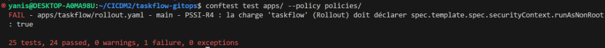

#### Preuve 49 : Succès des deux Quality Gates sur la Pull Request #18
Après ajout de `securityContext.runAsNonRoot: true` dans le manifest et ajout du fichier `.trivyignore`, nous avons ouvert la PR [#18](https://github.com/YanisHDD/taskflow-gitops/pull/18). Les deux jobs de sécurité GitHub Actions se sont exécutés avec succès :
- `PSSI / PSSI manifests (conftest)` : **Succès en 6s** (25 tests sur 25 réussis)
- `PSSI / PSSI images (Trivy)` : **Succès en 30s** (0 vulnérabilité non autorisée)  
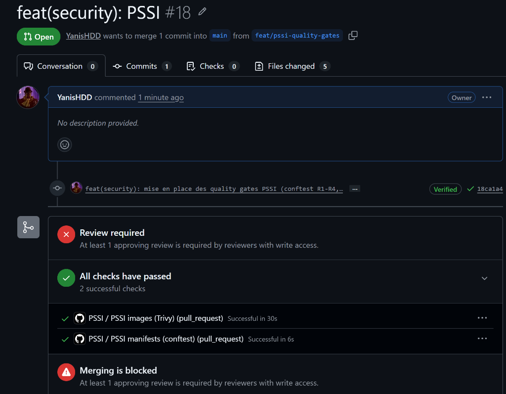

#### Preuve 50 : Blocage strict d'une Pull Request non conforme (PR #19)
Pour prouver que la chaîne protège activement le cluster, nous avons activé les deux contrôles comme **obligatoires (`Required`)** dans le ruleset GitHub `protect-main`, puis ouvert la PR [#19](https://github.com/YanisHDD/taskflow-gitops/pull/19) en spécifiant volontairement le tag interdit `image: ghcr.io/9m7fjfpv9k-cyber/taskflow:latest`.  
Le résultat est sans appel :
- Les checks sont immédiatement passés au **rouge** (`All checks have failed`).
- GitHub a verrouillé le bouton de validation : **`Merging is blocked - At least 1 approving review is required / Required checks failed`**.  
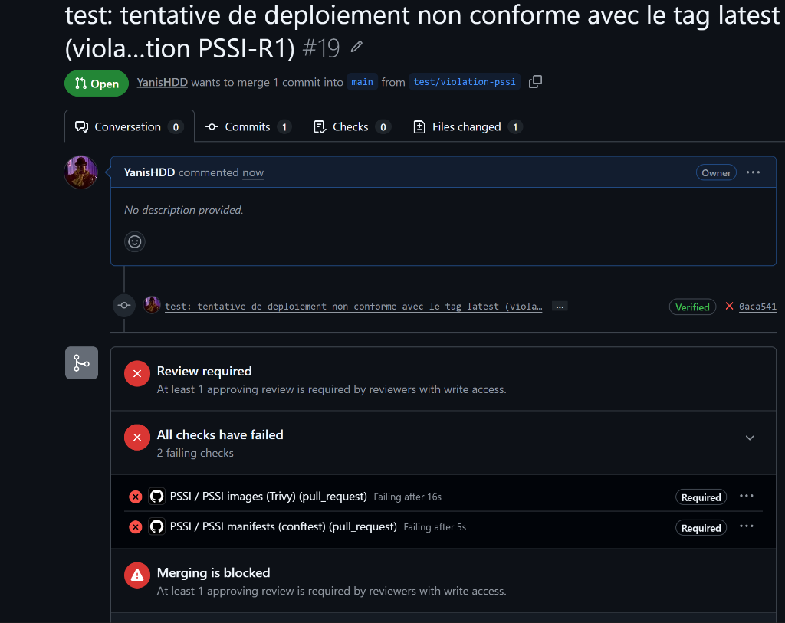

---

### 4. Exercice de Synthèse : Analyse de la Faille `GET /tasks/search` (Slide 18)

#### Identification de la faille dans le code
Dans le dépôt `cicd-fil-rouge` à la ligne 56 du fichier `app/main.py`, la recherche de tâches est implémentée ainsi :
```python
query = f"SELECT id, title, done FROM tasks WHERE title LIKE '%{q}%' ORDER BY id"
```
**Diagnostic :** Il s'agit d'une faille critique d'**Injection SQL (SQLi)** causée par l'interpolation directe du paramètre utilisateur non assaini `q` dans la chaîne de requête SQL, au lieu d'utiliser des requêtes paramétrées avec des curseurs sécurisés (`?` ou `:q`).

#### Tableau comparatif : Qui trouve la faille de `GET /tasks/search` ?

| Type de test | La trouve ? | Quelle information ? | Quand ? | Limite ? |
|---|:---:|---|---|---|
| **SAST** *(ex: Bandit, Semgrep)* | **Oui** *(code dans le dépôt)* | • **Ligne et fichier :** `app/main.py:56`<br>• **Type de faille :** Injection SQL (CWE-89)<br>• **Cause :** Utilisation d'une `f-string` non assainie dans un curseur SQL (`cursor.execute`) | **Tôt dans la CI (Shift-Left)**<br>Analyse statique du code source, sans exécution. | Risque de **faux positifs** (alerte sur du code théorique ou inactif) ; ne voit pas les erreurs de config d'infrastructure. |
| **DAST** *(ex: OWASP ZAP)* | **Oui** *(la route existe)* | • **Point d'entrée :** Endpoint `GET /tasks/search`<br>• **Paramètre vulnérable :** Champ `q`<br>• **Preuve :** Réponse HTTP anormale au payload SQL (fuite de données ou erreur SQL 500)<br>• *(Ne donne aucune ligne de code)* | **Tardif (boîte noire)**<br>Sur l'application déployée en staging/recette. | **Vue externe aveugle :** Ne sait pas où est le code source pour corriger ; nécessite une app démarrée et des routes crawlées. |
| **IAST** *(ex: Contrast Security)* | **Oui** *(la route a un test)* | • **Vue hybride complète :**<br>  1. Requête HTTP et payload injecté dans `q`<br>  2. Cheminement de la donnée non assainie (*taint analysis*)<br>  3. Ligne de code source exacte (`app/main.py:56`) | **Pendant les tests**<br>Une sonde instrumente le runtime pendant les tests d'intégration. | **Dépendance aux tests :** Totalement aveugle si la route n'est pas appelée par la suite de tests automatisés. |
| **RASP** *(Protection Runtime)* | **Non** *(Ce n'est pas un test)* | Détecte et bloque l'attaque en direct au moment où la requête malveillante arrive sur le conteneur. | **En production**<br>Activé au runtime de l'application. | Mesure de défense active et non un outil de validation CI/CD ; impact potentiel sur la latence. |

---

### 5. Traçabilité & Pistes d'Optimisation du Pipeline (Slide 16 & 19)

#### A. Les 4 Piliers de la Traçabilité
1. **Qui et Pourquoi ?**  
   Chaque modification passe par une Pull Request documentée, avec relecture et approbation obligatoire (`Required approval` par le binôme Yanis / Moustapha) et satisfaction des checks obligatoires.
2. **Quoi ?**  
   L'historique des commits Git immuables et les révisions d'Argo Rollouts (`rev:1` à `rev:4`) identifiant rigoureusement le tag et le SHA de chaque image déployée.
3. **Quand ?**  
   Les horodatages stricts des événements Kubernetes (conservés ~1h dans le cluster), les logs k6 et l'historique des commits Git.
4. **Les écarts assumés ?**  
   Toute dérogation est formellement consignée dans le fichier [`.trivyignore`](file:///.trivyignore), avec commentaire, date et nom des approbateurs.

#### B. Deux Pistes Concrètes d'Optimisation
1. **Mise en cache intelligente des bases de vulnérabilités Trivy :**  
   Actuellement, Trivy télécharge la base de données de vulnérabilités à chaque exécution du job dans GitHub Actions (~30 secondes). En utilisant `actions/cache` sur le répertoire de base de données de Trivy, le temps de contrôle des images en PR passe sous la barre des **5 secondes**.
2. **Filtrage par chemin (*Path Filtering*) pour éviter les builds inutiles :**  
   Configurer les workflows GitHub Actions avec des filtres `paths:` (ex: `paths: ['apps/**', 'policies/**']`) afin de ne déclencher `conftest` et `Trivy` que si des fichiers Kubernetes ou des politiques de sécurité ont été touchés. Une modification exclusive de la documentation (`README.md`, captures d'écran) ne consommera ainsi aucune ressource CI inutile.

